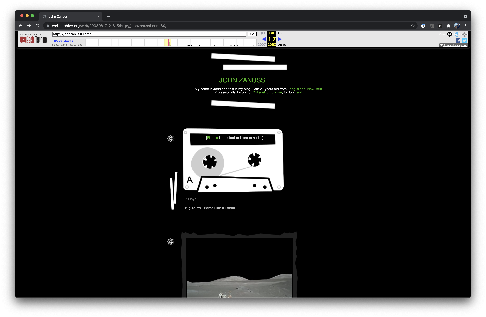

Back in the day, `johnzanussi.com` used to be the home of my Tumblr blog. Then, in 2014, I switched it to a single splash page with "Full site coming soon" in the footer. Well, almost eight years later, I've finally built a more elaborate website for myself. Below, I'll document some of my processes, the tools, libraries, and services I used, and what I would like to add in the future.

All the code that powers this website is available on my [GitHub](https://github.com/johnzanussi/johnzanussi.com).

<MDXColumns>

</MDXColumns>

## Requirements
* Uses technology I'm mostly familar with
* Easy to maintain
* Easy to deploy
* Performant
* Accessible
* Code that is sharable on GitHub

## Tools
* MacBook Pro
* Sublime Text
* Terminal

## Libraries

##### [Next.js](https://nextjs.org)
Next.js has quickly become my go-to for spinning up project sites. It's easy to use, comes with a good amount of starter projects, and deploys easily.

##### [React](https://reactjs.org)
Your only option for Next.js is React, which is fine by me since it's what I'm most comfortable with. I've been writing React regularly since 2016.

##### [Bootstrap](https://getbootstrap.com/)
For this project and another personal project, I gave [Tailwind](https://tailwindcss.com/) a chance. Tailwind is great if you're working in an established design system with a custom component library and just need utility classes. Bootstrap shines compared to Tailwind in the vast array of out-of-the-box components.

##### [Font Awesome](https://fontawesome.com/)
Font Awesome gets an honorable mention here as I used a handful of their icons throughout my site.

A full list of packages can be found in [`package.json`](https://github.com/johnzanussi/johnzanussi.com/package.json)

## Services

##### [Vercel](https://vercel.com/)
I didn't know much about Vercel until I was ready to deploy my first Next.js project. Out of everything here, I'm most impressed with Vercel. I've never experienced a more seamless out-of-the-box solution for deploying static websites. Best of all, it's free for personal projects.

##### [Fiverr](https://www.fiverr.com/)
Since I’m not the best at articulating my thoughts into words, I hired someone on Fiverr to proofread most of these site pages. I’ve used Fiverr in the past for various tasks and have had nothing but great experiences. 

## To Do
* Add [Lighthouse](https://developers.google.com/web/tools/lighthouse) results to this page
* Pull YouTube channel names, images, and notification setting from YouTube API
* Install [PropTypes](https://reactjs.org/docs/typechecking-with-proptypes.html) and add prop definitions
* Create light theme and theme switcher
* Install and configure [Prettier](https://prettier.io/)
* Create a way to embed [Thingiverse](https://www.thingiverse.com/) things
* Add pagination for Posts page
* Create a "More posts" component for the bottom of individual posts
