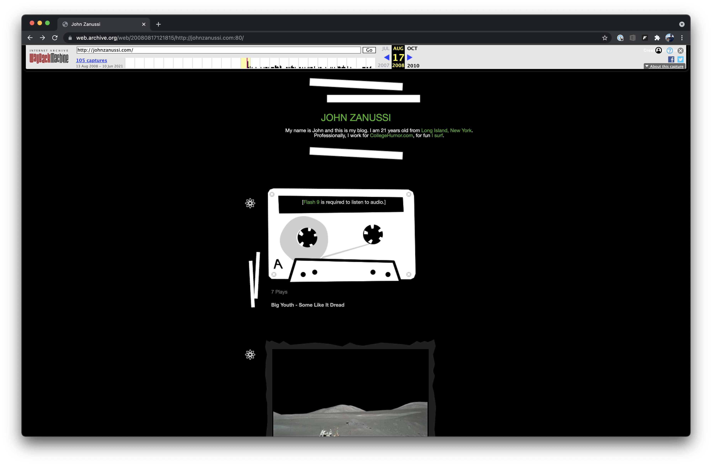

Back in the day (2008), [`johnzanussi.com`](https://johnzanussi.com) was the home of my Tumblr blog. Then, in 2014, I switched it to a single splash page with "Full site coming soon" in the footer. Almost eight years later, in late-2021, I finally built a more elaborate website for myself. Below, I'll document some of my processes, the tools, libraries, and services I used, and what I would like to add in the future.

All the code that powers this website is available on my [GitHub](https://github.com/johnzanussi/johnzanussi.com).

<Columns>

</Columns>

## Requirements

-   Uses technology I'm most familiar with
-   Easy to maintain
-   Easy to deploy
-   Performant
-   Accessible
-   Code that is sharable on GitHub

## Tools

-   MacBook Pro
-   Sublime Text
-   Terminal

## Libraries

##### [Astro](https://astro.build/)

As of February 2023, this website is built on Astro. While browsing Reddit one day, I saw someone mention Astro. I immediately fell in love with it as it takes static site generation to the next level. I plan on writing a detailed post comparing Astro to Next.js as it relates to this site. Until then, you can [check out what Astro is all about](https://astro.build/) or view the code that powers this site [on my GitHub](https://github.com/johnzanussi/johnzanussi.com).

##### [~~Next.js~~](https://nextjs.org)

~~Next.js has quickly become my go-to for spinning up project sites. It's easy to use, has many starter projects, and deploys easily.~~

##### [~~React~~](https://reactjs.org)

~~Your only option for Next.js is React, which is fine since it's what I'm most comfortable with. I've been writing React regularly since 2016.~~

##### [Bootstrap](https://getbootstrap.com/)

For this project and another personal project, I gave [Tailwind](https://tailwindcss.com/) a chance. Tailwind is great if you're working in an established design system with a custom component library and need utility classes. Bootstrap shines compared to Tailwind in the vast array of out-of-the-box components.

##### [Font Awesome](https://fontawesome.com/)

Font Awesome gets an honorable mention here, as I used a handful of their icons throughout my site.

A complete list of packages can be found in [`package.json`](https://github.com/johnzanussi/johnzanussi.com/package.json)

## Services

##### [Vercel](https://vercel.com/)

I didn't know much about Vercel until I was ready to deploy my first Next.js project. Out of everything here, I'm most impressed with Vercel. I've never experienced a more seamless out-of-the-box solution for deploying static websites. Best of all, it's free for personal projects.

##### [FastComments](https://fastcomments.com/)

I spent quite some time looking for the best way to add comments, including rolling my own, to this site but eventually landed on FastComments. The key aspects that won me over are that it's pretty feature-rich, doesn't require commenters to create accounts, offers a [React library](https://www.npmjs.com/package/fastcomments-react), and [collects as little data](https://fastcomments.com/privacy-policy) as possible. While FastComments is not free, my site does such little traffic and comment volume that it only costs me $0.99 a month.

##### [Plausible](https://plausible.io/)

I'm self-hosting Plausible at [analytics.johnzanussi.com](https://analytics.johnzanussi.com/) to collect traffic data from this site. I followed this [amazing guide](https://www.stackovercloud.com/2021/10/28/how-to-install-plausible-analytics-on-ubuntu-20-04/) to get the self-hosted instance installed and running on DigitalOcean. I'm also using the [`next-plausible`](https://github.com/4lejandrito/next-plausible) package to send tracking data to the self-hosted instance.

##### [Grammarly](https://www.grammarly.com/)

Since I’m not the best at articulating my thoughts into words, I started using Grammarly's Premium plan to check my work. It's most useful for me as a spell and grammar check, but I also appreciate some of the other suggestions, helping to make my words more readable.

## To Do

-   ✅ ~~Install and configure [Prettier](https://prettier.io/)~~ [493a49a](https://github.com/johnzanussi/johnzanussi.com/commit/493a49ad0587d9c8195c2bf735625c827664bd89)
-   ✅ ~~Create light theme and theme switcher~~ [#14](https://github.com/johnzanussi/johnzanussi.com/pull/14)
-   ✅ ~~Create a "More posts" component for the bottom of individual posts~~ [6844b46](https://github.com/johnzanussi/johnzanussi.com/commit/6844b46917bf863f5eb70e4b18557a24ba9cc13f)
-   ✅ ~~Add comments on posts~~ [87219d0](https://github.com/johnzanussi/johnzanussi.com/commit/87219d0045088a4cff94d5cd20d193cf6bd41bf6)
-   ✅ ~~Pull YouTube channel names, images, and notification setting from YouTube API~~
-   Convert to TypeScript
-   Add pagination for `/posts` page
-   Add [Lighthouse](https://developers.google.com/web/tools/lighthouse) results to this page
